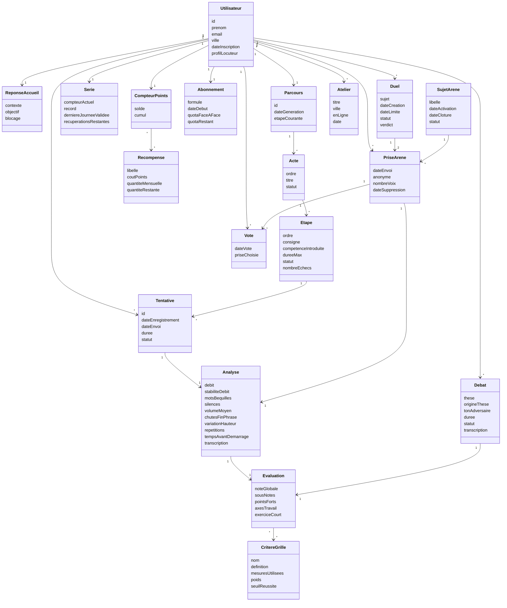
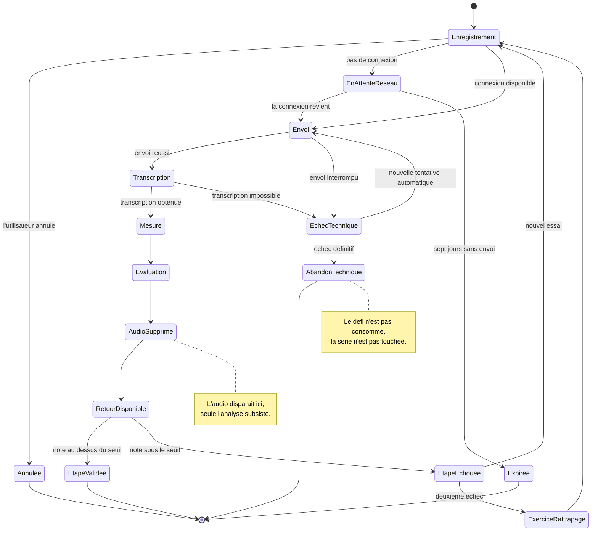
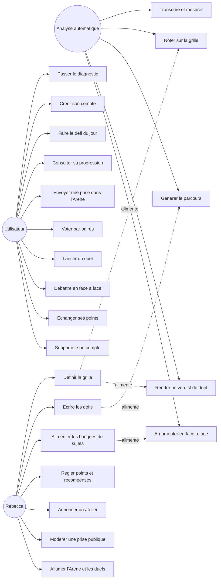
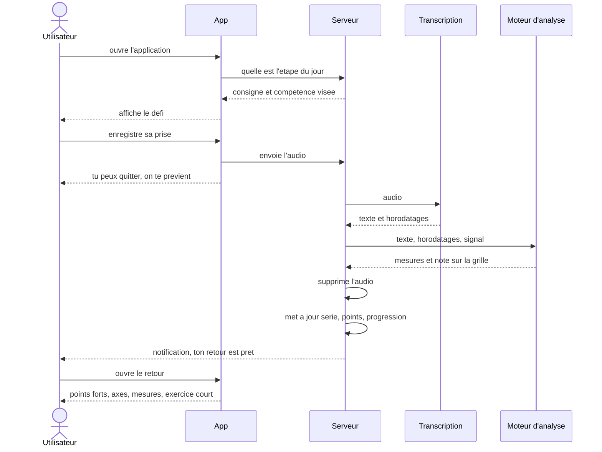
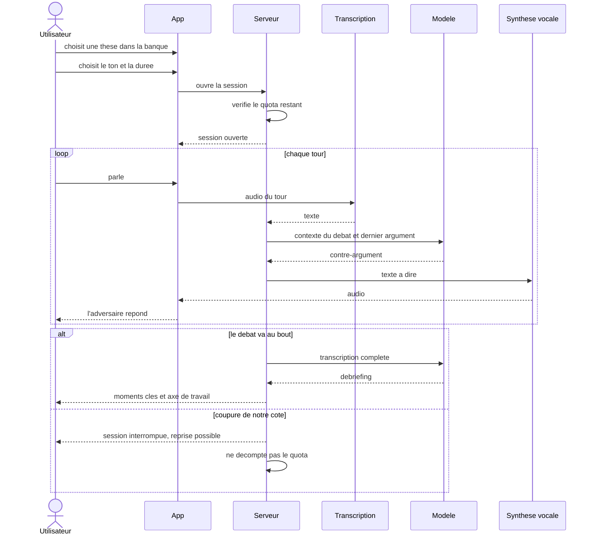
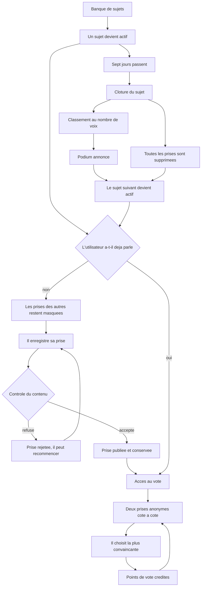

# LEQ, diagrammes

Août 2026

Ces diagrammes accompagnent le cahier des charges. Ils sont écrits en Mermaid, donc en texte, ce qui permet de les modifier sans repasser par un outil de dessin et de les suivre au même titre que le reste du projet.

Le modèle de domaine vient en premier parce que tous les autres s'appuient sur les noms qu'il fixe.

---

## 1. Modèle de domaine

Ce que manipule l'application et comment les objets s'attachent les uns aux autres. Deux choses méritent d'être remarquées ici. L'enregistrement audio n'apparaît nulle part comme quelque chose qu'on garde, seule l'analyse subsiste. Et la prise envoyée dans l'Arène est un objet distinct d'une tentative ordinaire, précisément parce que son cycle de vie est différent.

---

## 2. Cycle de vie d'une tentative

C'est le diagramme le plus important du lot, parce qu'il contient tous les cas où les choses se passent mal et que ce sont eux qu'on oublie en général. Une tentative qui échoue pour une raison technique ne consomme pas le défi du jour et ne casse pas la série.

---

## 3. Qui fait quoi

Trois acteurs. L'utilisateur, Rebecca dans son espace d'administration, et l'analyse automatique qui n'est pas une personne mais qui prend des décisions visibles par l'utilisateur, donc qui mérite d'apparaître.

---

## 4. La boucle quotidienne

Ce qui se passe entre le moment où quelqu'un ouvre l'application et celui où il reçoit son retour. Le point à retenir est qu'il peut partir pendant l'analyse et qu'on le rappelle.

---

## 5. Le face-à-face

La difficulté est dans la boucle du milieu, qui doit tourner sous les deux secondes à chaque tour. Tout le reste est simple.

---

## 6. La semaine d'Arène

Un sujet vit sept jours. On peut parler et voter pendant toute cette durée, ce qui évite d'imposer un créneau à des gens qui ont une vie par ailleurs.

---

## 7. Ce que ces diagrammes ne couvrent pas encore

Deux zones restent volontairement vides parce que les décisions ne sont pas prises. Les règles que doit respecter le générateur de parcours, qui mériteront leur propre schéma une fois écrites. Et le détail de l'espace d'administration, qui dépend de ce que Rebecca voudra réellement piloter au quotidien.
