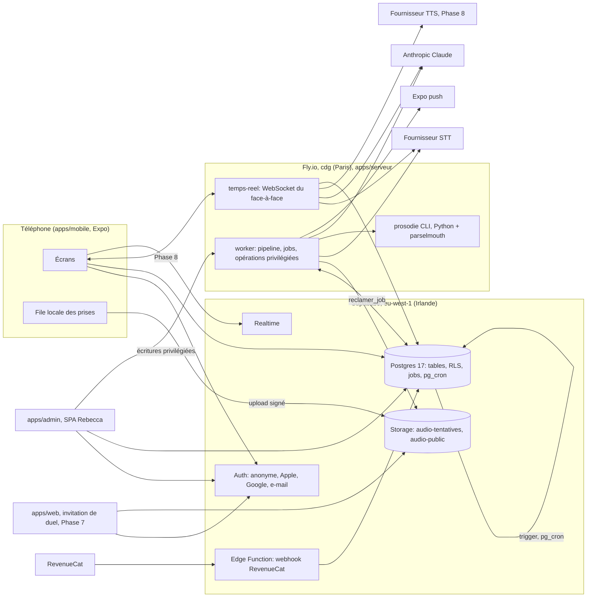
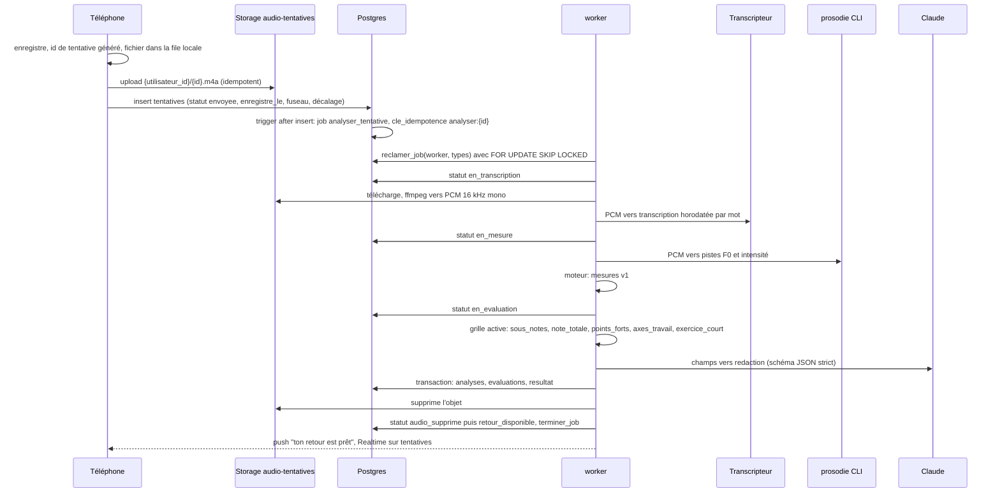
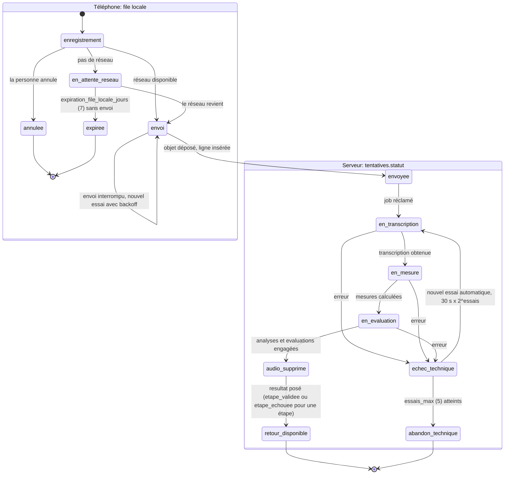

# Architecture

The system as decided in the approved plan. Each big choice links to its decision record in [decisions/](decisions/README.md). The data contract is [DATA-MODEL.md](DATA-MODEL.md).

## In one paragraph

An Expo app records a take and uploads it under a client-generated id to a private Supabase bucket in Ireland, then inserts a `tentatives` row. A database trigger enqueues a job. A Node worker on Fly.io in Paris claims the job, decodes the audio, gets a timed transcript from the STT provider, gets pitch and intensity tracks from a Praat CLI, computes the measures in TypeScript, scores them on Rebecca's versioned grid, asks Claude for the French wording under a strict JSON schema, commits `analyses` and `evaluations`, deletes the audio, marks the attempt `retour_disponible` and notifies the phone. Everything the app reads afterwards is numbers and text. Rebecca edits configuration, flags, grid, banks and announcements in a React SPA under row-level security with an admin role carried in the JWT. The debate runs on a second process group of the same service, over a WebSocket, so signal processing never starves it.

## Components

## What lives where

| Concern                                                                 | Where                                                         | Notes                                                                        |
| ----------------------------------------------------------------------- | ------------------------------------------------------------- | ---------------------------------------------------------------------------- |
| Domain schema, RLS, triggers, cron schedules                            | `supabase/migrations`                                         | Contract in DATA-MODEL.md                                                    |
| Domain types and validation                                             | `packages/domaine`                                            | Zod 4; imported by every app                                                 |
| Measures from PCM plus transcript                                       | `packages/moteur`                                             | No I/O; tested on fixtures                                                   |
| Pitch and intensity tracks                                              | `apps/serveur/prosodie`                                       | Praat through parselmouth, ADR-008                                           |
| Pipeline orchestration, job loop, storage deletion, push, provider keys | `apps/serveur` (`worker`)                                     | Service role, direct Postgres connection                                     |
| Debate loop                                                             | `apps/serveur` (`temps-reel`)                                 | Phase 8                                                                      |
| Recording, local queue, offline retry, local notifications              | `apps/mobile`                                                 | Client-only states live here                                                 |
| Configuration, flags, grid, banks, moderation, announcements            | `apps/admin`                                                  | Reads and writes under RLS as admin; privileged writes go through the server |
| Duel invitation in the browser, legal pages                             | `apps/web`                                                    | Phase 7                                                                      |
| Subscriptions                                                           | RevenueCat, webhook to `abonnements` through an Edge Function | Phase 4                                                                      |
| Push delivery                                                           | Expo push, sent by the worker                                 | Phase 1 for "ton retour est prêt"                                            |
| Tunables                                                                | `configuration` and `drapeaux` tables                         | Read at app startup; edited by Rebecca                                       |

## Data flow of an attempt

Sequence in the normal case:

Lifecycle, with the split between phone-only states and server statuses (`tentatives.statut`). The phone states are the cahier's diagram; the server statuses are the contract's check constraint.

Rules attached to the diagram:

- `abandon_technique` consumes nothing: the day's challenge and the streak are untouched (screen X3). The sweeper deletes the audio (ADR-005).
- `enregistre_le`, `fuseau_horaire` and `decalage_minutes` come from the phone at recording time; the streak day is the day the person spoke, even if the file arrives later. Dates in the future or older than the local expiry are rejected by the insert constraints.
- The remediation exercise after two failures (X5) and the daily rhythm are path rules applied by the server when it sets `resultat`; they are not attempt statuses.
- The client never updates or deletes a `tentatives` row; it inserts once and reads.

## The jobs queue

One table, `jobs`, and four security-definer functions, all in DATA-MODEL.md. pg_cron only inserts jobs; the worker executes them idempotently, because SQL cannot delete storage objects or send push.

- Claim: `reclamer_job(p_worker, p_types)` returns one row with `FOR UPDATE SKIP LOCKED` where `statut = 'en_attente'` and `disponible_a <= now()`, sets `en_cours`, `verrouille_a`, `verrouille_par`, increments `essais`. Several workers can run without double execution.
- Finish: `terminer_job(id)`.
- Fail: `echouer_job(id, erreur)` puts the job back to `en_attente` with `disponible_a = now() + 30 s x 2^essais`, or to `echoue` when `essais >= essais_max` (5).
- Stuck: `liberer_jobs_bloques(interval)` every 5 minutes returns any `en_cours` older than 15 minutes to `en_attente` (a machine died mid-job).
- Idempotence: `cle_idempotence` is unique; the attempt trigger uses `analyser:{id}`, the sweeper uses `balayer:{hour}`, so retries and duplicate cron ticks insert nothing twice.
- Phase 0 types: `analyser_tentative` (trigger), `balayer_audio` (every 30 min), `purger_anonymes` (hourly), `supprimer_compte` (on request). Later phases add weekly Arena rotation, duel expiry, announcement sending.
- The worker loop: claim with the list of types it knows, run the handler in a try block, finish or fail, sleep `INTERVALLE_INACTIF_MS` when the claim is empty. Handlers are written to be re-run safely (check the current state before acting).

## The two Fly process groups

One image, one `fly.toml`, two `[processes]` entries, region `cdg`, `min_machines_running = 1` each:

- `worker`: the job loop and the analysis pipeline. CPU bound (ffmpeg, Praat, the engine). Scales by adding machines; claims are safe under concurrency.
- `temps-reel`: the debate WebSocket (Phase 8). Latency bound. Holds a connection for 3 to 8 minutes per session, streams STT, Claude and TTS. Persists each turn in Postgres so a session survives a machine death (E3b).

The process is selected by `PROCESS` (falls back to Fly's `FLY_PROCESS_GROUP`). Both share config loading, logging, the Supabase client and the direct Postgres pool. Health on `/sante` for both; the WebSocket route exists only on `temps-reel`.

## Security model

- Row Level Security on every table; the service role (server only) bypasses it.
- `profils.role` is copied into `app_metadata.role` by the custom access token hook `hook_jeton_acces`; policies check `public.est_admin()`. Only the service role or a direct database connection (the worker, an operator) can change `role` or `suspendu_le`; a trigger refuses every signed-in client.
- Anonymous users are recognised with `public.est_anonyme()` (the `is_anonymous` claim) and limited to the diagnostic (ADR-004).
- Storage: clients may only insert at `{auth.uid()}/{uuid}.m4a` in `audio-tentatives`; no client read, update or delete. `audio-public` is served by signed URLs (Phase 7).
- Clients never hold provider keys. The publishable Supabase key and the RevenueCat public SDK key are the only keys in the app, both public by design.
- Caps and filters (announcements per month, geo filter, quotas) are enforced in the server write path, never only in the SPA.
- Moderation is a state (`en_moderation`) between analysis and publication for public takes (Phase 7).

## Configuration and flags

`configuration` is a typed key/value table (`nombre`, `texte`, `booleen`, `json`) with a French description per key, seeded by `supabase/seed.sql` with the defaults listed in DATA-MODEL.md (never overwriting a value Rebecca changed), read once at app startup and cached, editable by Rebecca. `drapeaux` holds three flags shipped off: `arene`, `duels`, `face_a_face`. The tab bar and every entry point read them; when off, the feature does not appear at all (screens C0, B5b, H5b). Trial length is not configuration: it is defined in the stores.

## Big choices and why

| Choice                                                             | Reason in one sentence                                                                                                                               | Record                                                                 |
| ------------------------------------------------------------------ | ---------------------------------------------------------------------------------------------------------------------------------------------------- | ---------------------------------------------------------------------- |
| Expo plus Supabase (Ireland) plus one Node service on Fly in Paris | Roch knows the first two; Edge Functions cannot run 90 s of signal processing nor hold a 5 minute socket; privileged operations need a server anyway | [ADR-001](decisions/ADR-001-stack.md)                                  |
| Praat for prosody, TypeScript for everything else                  | JavaScript pitch trackers make octave errors; Praat is the validated reference; the boundary is tiny (PCM in, tracks out)                            | [ADR-008](decisions/ADR-008-praat-prosody.md)                          |
| npm workspaces monorepo                                            | Four apps share one domain; types are imported, not copied; one `npm run check`                                                                      | [ADR-002](decisions/ADR-002-monorepo.md)                               |
| French domain, English plumbing                                    | The cahier, the diagrams, Rebecca and the users all speak French; infrastructure words do not                                                        | [ADR-003](decisions/ADR-003-french-domain-vocabulary.md)               |
| Diagnostic before account, via anonymous sign-in                   | The cahier says the account comes last; the pipeline still needs a principal; rows are purged after 72 h                                             | [ADR-004](decisions/ADR-004-anonymous-diagnostic.md)                   |
| Audio transient by construction                                    | A written promise cannot depend on a happy path; every path ends in deletion, with a sweeper wider than the retry window                             | [ADR-005](decisions/ADR-005-transient-audio.md)                        |
| Fields first, versioned grid, wording derivative                   | Nothing downstream can use a paragraph; the grid will change and history is never rescored                                                           | [ADR-006](decisions/ADR-006-structured-feedback-and-versioned-grid.md) |
| Ledgers, not counters                                              | Points, quota and streak must be replayable and must never be consumed by our own failures                                                           | pending ADR, Phase 5                                                   |
| pg_cron inserts jobs, the worker executes                          | SQL cannot delete storage objects or send push; one queue, one retry policy                                                                          | pending ADR                                                            |
| No hard-coded tunables                                             | Rebecca changes rates and durations without a release; chapter 8 of the cahier                                                                       | pending ADR                                                            |
| Admin role in the JWT through a hook                               | Policies read a claim, no extra query per request, no client-side trust                                                                              | pending ADR                                                            |
| STT behind a `Transcripteur` interface, chosen by a bench          | French with accents decides the engine's quality; batch and streaming may not have the same winner                                                   | Phase 2 bench report                                                   |
| Claude with structured outputs, proxied by the server              | Wording, generation, Rétor, debriefs and moderation need JSON the code can trust; no key on the phone                                                | pending ADR, Phase 3                                                   |
| RevenueCat, local notifications plus Expo push                     | Prices live in the stores; timezone-correct reminders must not depend on a server; four independent toggles                                          | pending ADR, Phase 4 and 6                                             |

## Later phases in one line each

- Arena (Phase 7): a subject bank, one active subject derived lazily from activation and closure dates, hidden takes until you have spoken, pair voting with balanced sampling and impression tracking, one `prises_publiques` table for subject and duel takes, anonymity during votes, deletion at closing, `apps/web` for the invitee.
- Face-à-face (Phase 8): streaming STT with endpointing while the user speaks, streamed Claude, sentence-chunked TTS, per-turn persistence, resume window from `reprise_debat_minutes`, session ledger with outcome, debrief from the transcript.
